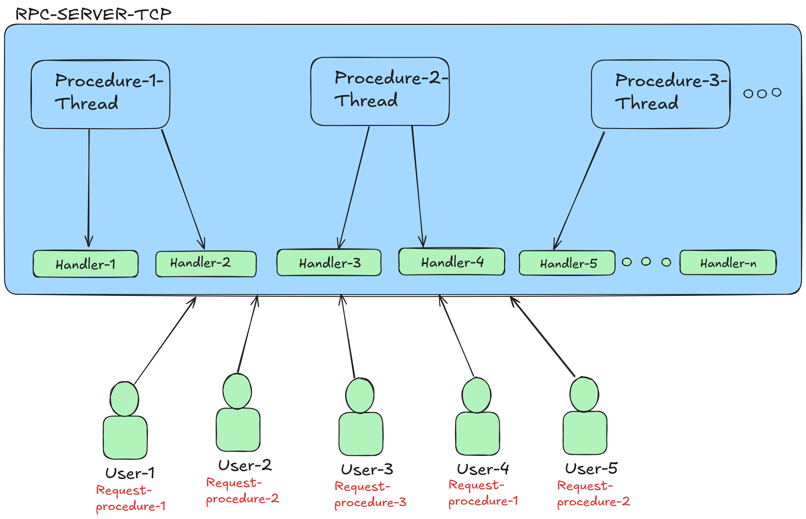

Simple RPC Library (SRPC)
=========================

SRPC is a lightweight Remote Procedure Call (RPC) library designed for clean abstraction between distributed services or processes, facilitating rapid prototyping.

Features
--------
- Simple API for exposing and calling remote functions.
- Pythonic conventions to define interfaces: use abstract base classes
  (Python conventions serve as the interface definition language).
- Concurrent server (can accept multiple clients simultaneously).
- Plug-and-play.
- Server-side binder (with LOOKUP and REGISTER support).
- Client-side binder (single call to discover service/function ports).
- Remote Exception Propagation:
  - Serialization: Convert server-side exceptions into a transmissible form.
  - Rehydration: Raise an equivalent exception on the client side.

Architecture
------------


How It Works
------------

The diagram below illustrates the RPC workflow between client and server:
```
+-----------------------------+            +------------------------------+
|           CLIENT            |            |            SERVER            |
+-----------------------------+            +------------------------------+
| User Code                   |            |                              |
| ------------------------->  | 1. Call RPC stub with method + args       |
| RPC Stub / Proxy            |            |                              |
| ------------------------->  | 2. Prepare request object                 |
| Serializer (e.g., JSON)     |            |                              |
| ------------------------->  | 3. Serialize method & args                |
| Transport Layer (TCP/IP)    | ---------> | 4. Receive request bytes      |
|                             |            | Transport Layer              |
|                             |            | -------------------------->  |
|                             |            | Deserialize request          |
|                             |            | Serializer                   |
|                             |            | -------------------------->  |
|                             |            | Extract method + args        |
|                             |            | RPC Dispatcher               |
|                             |            | -------------------------->  |
|                             |            | Locate & invoke target fn    |
|                             |            | Target Function              |
|                             |            | -------------------------->  |
|                             |            | Return result                |
|                             |            | Serializer                   |
| <-------------------------- | <----------| Serialize return value       |
| Deserializer                |            |                              |
| <-------------------------- |            |                              |
| RPC Stub                    |            |                              |
| Return result to user       |            |                              |
+-----------------------------+            +------------------------------+
```
How to Use the Library
----------------------

Strict adherence to naming conventions is required for the plug-and-play facility.

1. Project Setup

Place the following files/directories in your project root:

- interface/
- Rpc_Serializer.py
- Rpc_Client_Binder.py
- Rpc_Server_Binder.py
- Rpc_Exceptions.py

2. Define Your Interface

Write an interface that represents the procedures you want to expose.

- Save as: \<Modulename\>_Interface.py
- Use the interface name: \<ModuleName\>Interface
- Place it in the root of your project.

Example:

```python
# Calc_Interface.py
from abc import ABC, abstractmethod

class CalcInterface(ABC):
    @abstractmethod
    def add(self, a: int, b: int) -> int:
        pass

    @abstractmethod
    def sub(self, a: int, b: int) -> int:
        pass
```

3. Implement the Interface (Server-Side)

- In a file \<Modulename\>.py, write a class named \<Modulename\>.
- Place it in the root of your project.

4. Generate the Stubs

Run rpc_stub_generator.py and provide:

- Path of the interface: \<Modulename\>_Interface.py
- Server IP address
(Also, follow instructions from the stub generator.)

5. Copy the Generated Files

Place these in your project root:

- \<Modulename\>_rpc_client_stub.py
- \<Modulename\>_rpc_server_stub.py

6. Server Example

```python
# rpc_server.py
from Rpc_Server_Binder import RpcServerBinder
from Calc_rpc_server_stub import RpcServerStub  # from <Modulename>_rpc_server_stub import RpcServerStub
import threading

HOST = "localhost"
server_stub = RpcServerStub(HOST)
binder = RpcServerBinder(HOST)

binder_thread = threading.Thread(target=binder.start_binder, name="binder_thread", daemon=True)
binder_thread.start()

server_stub.start()
input("Server started, press any key to stop...")
binder.stop()
server_stub.stop()
```

7. Client Example

```python
# rpc_client.py
from Calc_rpc_client_stub import Calc_Stub  # from <Modulename>_rpc_client_stub import <Modulename>_Stub

calc = Calc_Stub()
a = 5
b = 6
print(f"{a} + {b} = {calc.add(a, b)}")
print(f"{a} * {b} = {calc.mult(a, b)}")
```

Final Thoughts
--------------

With this library, you can quickly configure and consume an interface-oriented RPC server. 
It was developed using a minimal, native Python approach.

DISCLAIMER:
No performance tests or rigorous security analysis have been conducted. Do not use this in production environments.

Possible Future Extensions:
- Performance tests
- Security analysis
- Authentication layers

License
-------

[](https://opensource.org/licenses/MIT)