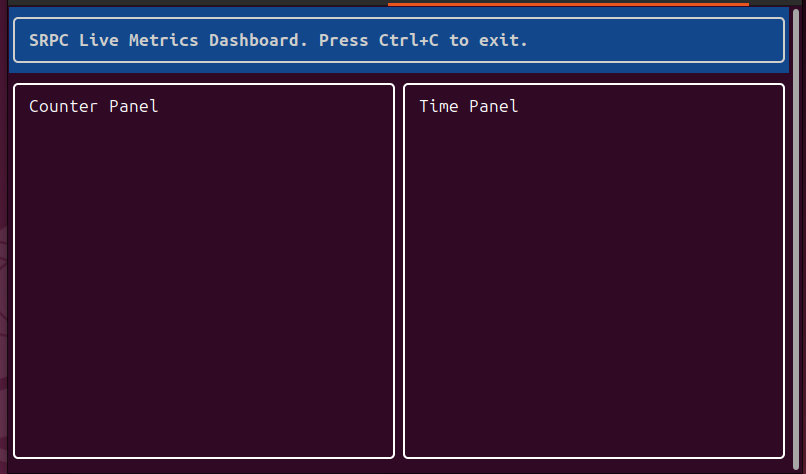
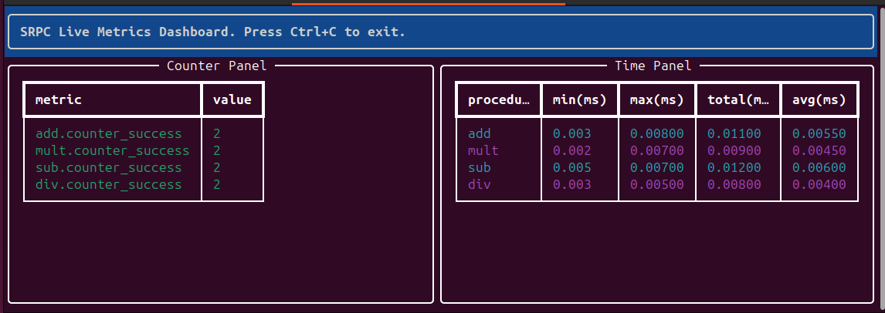

# Simple RPC Library (SRPC)

SRPC is a lightweight Remote Procedure Call (RPC) library that provides a clean abstraction layer between distributed processes,<br> 
enabling rapid development and integration of distributed services.

## Table of Contents
- [1. Features](#1-features)
- [2. How to Use the Library](#2-how-to-use-the-library)
    - [2.1 Implementing a Distributed Calculator using SRPC](#2-implementing-a-distributed-calculator-using-srpc)
    - [2.2 Using the live metrics dashbord](#3-using-the-live-metrics-dashbord)
- [3. How RPC Works](#3-how-rpc-works)
- [4. Final Thoughts](#4-final-thoughts)

## 1. Features
- **Simple API** for exposing and calling remote procedures.
- **Interface definition through Python conventions** (no separate IDL required).
- **Plug-and-play architecture** — install and start implementing immediately.
- **Remote exception propagation**  
  - **Serialization:** Convert server-side exceptions.  
  - **Rehydration:** Raise equivalent exceptions on the client side.
- **Stub generation** for server and client.
- **Live metrics dashboard**, displaying call count and latency per procedure.

## 2. How to Use the Library
 
***Strict naming conventions are required for the plug-and-play functionality.***

### 1. Download and Install the library
1. Download the latest release from the **GitHub Releases** page.
2. Extract the archive
3. Open the terminal inside `srpcLib-<version>` directory.
4. To install the package run: `pip install .`

### 2. Implementing a Distributed Calculator using SRPC

Let’s build a simple distributed calculator service that supports the four basic arithmetic operators.<br>
(***Addition***, ***Subtraction***, ***Multiplication***, ***Division***)


#### Server Directory Structure
```
project/
├─ calc/
│  ├─ __init__.py
│  ├─ calc_interface.py
│  ├─ calc.py
├─ srpc_calc_server_stub.py
├─ server.py
...
```
- `calc` directory name, is the name of the package, that the server will serve
- `calc_interface.py` is the service interface
- `calc.py` is the service implementation

***Both the service-package directory and the service-package.py file should have the same name.***<br>
***I recommend only use lowercase for it.***

We need to implement `calc_interface.py`, `calc.py` and `server.py`.<br>
Copy the following code:
```python
# calc_interface.py
from abc import ABC, abstractmethod

# The interface class name must be <package-name>Interface. 
# The first character must be uppercase.
class CalcInterface(ABC):
    @abstractmethod
    def add(self, a: int, b: int) -> int:
        pass

    @abstractmethod
    def sub(self, a: int, b: int) -> int:
        pass

    @abstractmethod
    def mult(self, a: int, b: int) -> int:
        pass

    @abstractmethod
    def div(self, a: int, b: int) -> int:
        pass
```
```python
# calc.py
from .calc_interface import CalcInterface

# The service class name must be <package-name>. 
# The first charactre must be in uppercase.
class Calc(CalcInterface):
    def add(self, a: int, b: int) -> int:
        return a + b

    def sub(self, a: int, b: int) -> int:
        return a - b

    def mult(self, a: int, b: int) -> int:
        return a * b

    def div(self, a: int, b: int) -> int:
        return a / b
```
```python
# server.py
from srpc_calc_server_stub import SrpcCalcServerStub

calcServerStub = SrpcCalcServerStub()
calcServerStub.start()
```

#### Client Directory Structure
```
project/
├─ calc/
│  ├─ __init__.py
│  ├─ calc_interface.py
├─ srpc_calc_client_stub.py
├─ client.py
...
```
We need implement `calc_interface.py` and `client.py`.<br>
Copy the following code:
```python
# calc_interface.py
from abc import ABC, abstractmethod

# The interface class name must be <package-name>Interface. 
# The first character must be in uppercase.
class CalcInterface(ABC):
    @abstractmethod
    def add(self, a: int, b: int) -> int:
        pass

    @abstractmethod
    def sub(self, a: int, b: int) -> int:
        pass

    @abstractmethod
    def mult(self, a: int, b: int) -> int:
        pass

    @abstractmethod
    def div(self, a: int, b: int) -> int:
        pass
```
```python
# client.py
from srpc_calc_client_stub import SrpcCalcClientStub

SERVER_HOST = "127.0.0.1" # You should use your LAN IP
calcStub = SrpcCalcClientStub(SERVER_HOST)

a = 4
b = 2

print(f"{calcStub.add(a, b)}")
print(f"{calcStub.mult(a, b)}")
print(f"{calcStub.sub(a, b)}")
print(f"{calcStub.div(a, b)}")
```
#### Generate the Stubs
The tool to generate the stubs is `srpc_stub_gen`.<br>
In server directory run the command:<br>
`python -m srpcLib.tools.srpc_stub_gen calc/calc_interface.py`<br>

This will generate two files `srpc_calc_server_stub.py` and `srpc_calc_client_stub.py`.<br>

- `srpc_calc_server_stub.py` is the server-side stub
- `srpc_calc_client_stub.py` is the client-side stub

Move the `srpc_calc_client_stub.py` file to client directory.<br>

#### Running the Server and Client

The server uses `127.0.0.1` by default.  
If your machine is connected to a LAN, it will automatically use your LAN IP address.

To check your IP address:
- Windows: `ipconfig`
- Linux: `ifconfig`

**Start the server:**
```bash
python server.py
```
You should see something like this:<br>


**Start the client:**
```bash
python client.py
```

### 3. Using the live metrics dashbord
***Observation: This tool requires rich package, to install it run***: `pip install rich`<br>

The `srpc_show_metrics` allows you to see call count(sucess or fail) and latency per procedure, in real time.<br>
To view it, run this command inside the server directory:
```bash
python -m srpcLib.tools.srpc_show_metrics srpc_server_metrics.log
```
You should see something like this:


In another terminal window, go inside the client directory and run `python client.py` two times.<br>
***Now back to srpc_show_metrics terminal window, you should see something like this:***<br>



## 3. How RPC Works

The diagram below illustrates the RPC workflow between client and server:
```
+-----------------------------+            +------------------------------+
|           CLIENT            |            |            SERVER            |
+-----------------------------+            +------------------------------+
| User Code                   |            |                              |
| ------------------------->  | 1. Call RPC stub with method + args       |
| RPC Stub / Proxy            |            |                              |
| ------------------------->  | 2. Prepare request object                 |
| Serializer (byte buffer)    |            |                              |
| ------------------------->  | 3. Serialize method & args                |
| Transport Layer (TCP/IP)    | ---------> | 4. Receive request bytes     |
|                             |            | Transport Layer              |
|                             |            | -------------------------->  |
|                             |            | Deserialize request          |
|                             |            | Serializer                   |
|                             |            | -------------------------->  |
|                             |            | Extract method + args        |
|                             |            | RPC Dispatcher               |
|                             |            | -------------------------->  |
|                             |            | Locate & invoke target fn    |
|                             |            | Target Function              |
|                             |            | -------------------------->  |
|                             |            | Return result                |
|                             |            | Serializer                   |
| <-------------------------- | <----------| Serialize return value       |
| Deserializer                |            |                              |
| <-------------------------- |            |                              |
| RPC Stub                    |            |                              |
| Return result to user       |            |                              |
+-----------------------------+            +------------------------------+
```

## 4. Final Thoughts
--------------
With SRPC, you can rapidly configure and consume interface-oriented RPC services with minimal setup and native Python code.<br>

Possible Future Extensions:
- Authentication layers

For more details, check [V0.0.0 release notes](docs/release-notes/v0.0.0.md)

License
-------

[](https://opensource.org/licenses/MIT)