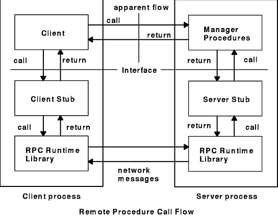
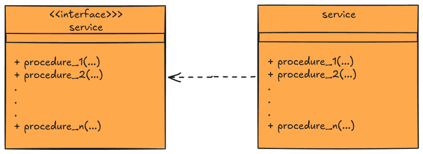

# SRPC Technical Documentation

## Table of contents
- [SRPC Technical Documentation](#srpc-technical-documentation)
  - [Table of contents](#table-of-contents)
  - [1. Introduction \& Concepts](#1-introduction--concepts)
    - [1.1 Wat is RPC](#11-wat-is-rpc)
    - [1.2 The SRPC](#12-the-srpc)
  - [2. High-Level Architecture](#2-high-level-architecture)
    - [2.1 What is a Service in SRPC](#21-what-is-a-service-in-srpc)
    - [2.2 Logical Architecture Diagram](#22-logical-architecture-diagram)
  - [3. The SRPC Protocol](#3-the-srpc-protocol)
    - [3.1 Wire Protocol](#31-wire-protocol)
  - [4. Core Compoentes(The Internals)](#4-core-compoentesthe-internals)
    - [4.1 The Serializer](#41-the-serializer)
    - [4.2 Binders(Transport Layer)](#42-binderstransport-layer)
      - [4.2.1 Server Binder](#421-server-binder)
      - [4.2.2 Client Binder](#422-client-binder)
    - [4.3 Stubs(The Proxies)](#43-stubsthe-proxies)
      - [4.3.1 Server Stub \& Threading Model](#431-server-stub--threading-model)
      - [4.3.2 Client Stub \& Threading Model](#432-client-stub--threading-model)
  - [5. Tooling \& Ecosystem](#5-tooling--ecosystem)
    - [5.1 Stub Generator](#51-stub-generator)
    - [5.2 Metrics](#52-metrics)
      - [5.2.1 Server-Side Logging](#521-server-side-logging)
      - [5.2.2 The Live Dashboard](#522-the-live-dashboard)


## 1. Introduction & Concepts

### 1.1 Wat is RPC
"In distributed computing, a remote procedure call (RPC) is an action in which a computer program causes a procedure to execute in a different address space of the current process (commonly on another computer on a shared computer network), which is written as if it were a local procedure call, without the programmer explicitly writing the details for the remote interaction. That is, the programmer writes essentially the same code whether the subroutine is local to the executing program, or remote. This is a form of server interaction (caller is client, executor is server), typically implemented via a request–response message passing system.The RPC model implies a level of location transparency, namely that calling procedures are largely the same whether they are local or remote, but usually, they are not identical, so local calls can be distinguished from remote calls. Remote calls are usually orders of magnitude slower and less reliable than local calls, so distinguishing them is important." - [Remote procedure call](https://en.wikipedia.org/wiki/Remote_procedure_call).

**Every modern service mesh is descendent of this ideia - just with better Cryptography and fewer open doors.**

"How it works? First, the caller process sends a call message that includes the procedure parameters to the server process. Then, the caller process waits for a reply message (blocks). Next, a process on the server side, which is dormant until the arrival of the call message, extracts the procedure parameters, computes the results, and sends a reply message. The server waits for the next call message. Finally, a process on the caller receives the reply message, extracts the results of the procedure, and the caller resumes execution.

The Remote Procedure Call Flow figure (Figure 1) illustrates the RPC paradigm." - [RPC Model](https://www.ibm.com/docs/en/aix/7.3.0?topic=call-rpc-model).

Figure 1. Remote Procedure Call Flow



### 1.2 The SRPC
SRP uses the RPC ideia, and provide a framework to make easy programmers implement services(set of procedures).
SRPC uses Python as IDL(Interface Definition Language), specifically the [abc module](https://docs.python.org/3/library/abc.html) to define service boundaries.

For those with a knack for language design, the idea is to view the use of [abstract types](https://en.wikipedia.org/wiki/Abstract_type)
as "a language" for specifying protocols or interfaces. As many languages implements this concept, essentialy the challenge to extend
the LIB for others langues is to understand "Sockets", "abstract types" and how each language implement types.
Now the LIB only suport Python language.

In the current stage of the project the technical aim is build a solid, extensibile and esay to refactor fundation.
thinking from the users' perspective - programers - the aim is simplify the implementation of distributed processes while preserving a clean programming abstraction.

Core Design Goals:
- Rapid Prototyping: Minimal setup, and auto-generated network bindings.
- Transparent Abstraction: Remote exceptions should feel like local exceptions to the client.

## 2. High-Level Architecture

### 2.1 What is a Service in SRPC
In SRPC, a "Service" is defined strictly by its directory structure and Python naming conventions.  \
This strictness enables the tooling to automatically generate network bindings.

A valid service(in server side) consists of:
1. The Interface: An abstract class defining the methods.
   - The class name must follow the <ServiceName>Interface pattern with an uppercase first letter (e.g., CalcInterface).
   - The class file name must follow the <ServiceName>_interface with an lowercase first letter (eg., calc_interface.py)

2. The Implementation:
   - A concrete class inheriting from the interface, named <ServiceName> with an uppercase first letter (e.g., Calc).
   - the concrete class file name must follow the <ServiceName>.py with an lowercase first letter(eg., calc.py)

3. The Directory
   - The packge directory containing these files must match the package name(all lowercase) exactly (e.g., calc/).

Look the example below, <em>calc</em> is my service name.
**Server Directory Structure**
```
project/
├─ calc/
│  ├─ __init__.py
│  ├─ calc_interface.py
│  ├─ calc.py
├─ srpc_calc_server_stub.py
├─ server.py
.
.
.
```
**Essentialy a SRPC service is an interface**

> [!WARNING]
> Maybe this perspective for client side too??
### 2.2 Logical Architecture Diagram


## 3. The SRPC Protocol

### 3.1 Wire Protocol

## 4. Core Compoentes(The Internals)

### 4.1 The Serializer

### 4.2 Binders(Transport Layer)
#### 4.2.1 Server Binder
#### 4.2.2 Client Binder

### 4.3 Stubs(The Proxies)
#### 4.3.1 Server Stub & Threading Model
#### 4.3.2 Client Stub & Threading Model

## 5. Tooling & Ecosystem
### 5.1 Stub Generator
### 5.2 Metrics
#### 5.2.1 Server-Side Logging
#### 5.2.2 The Live Dashboard
