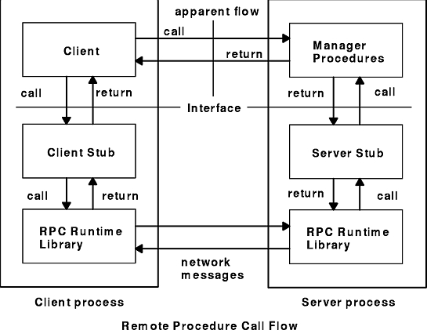
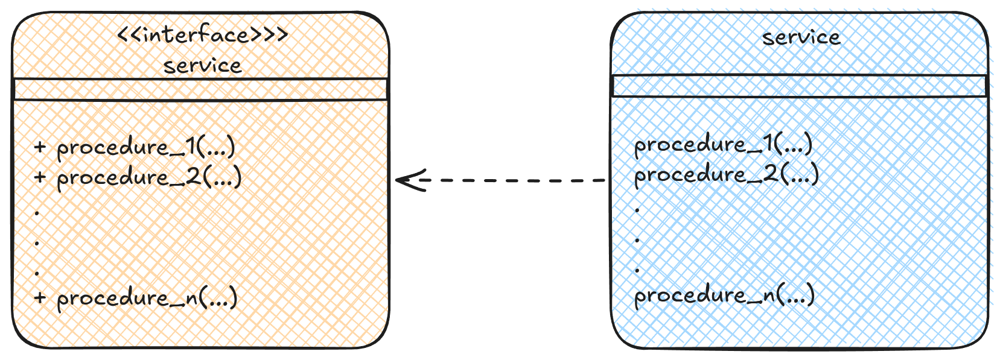
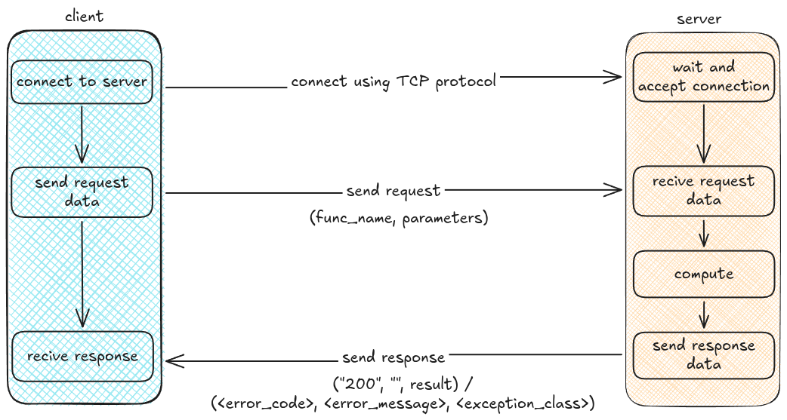
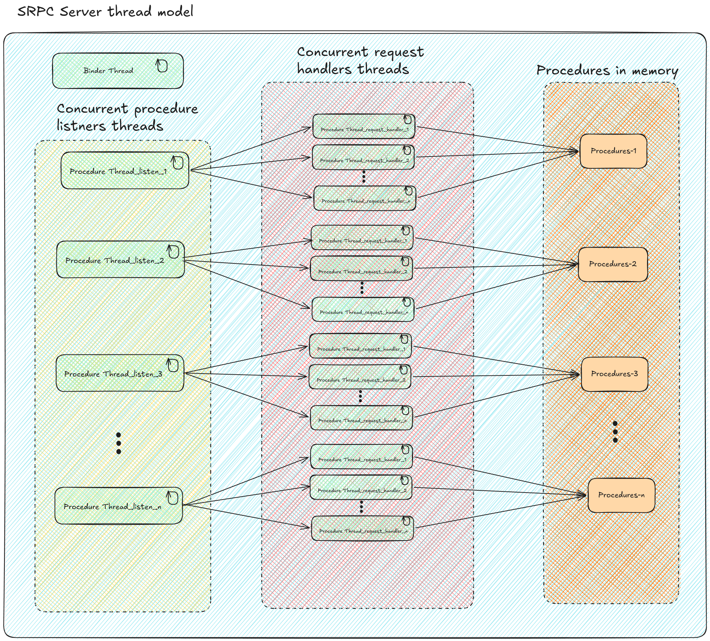
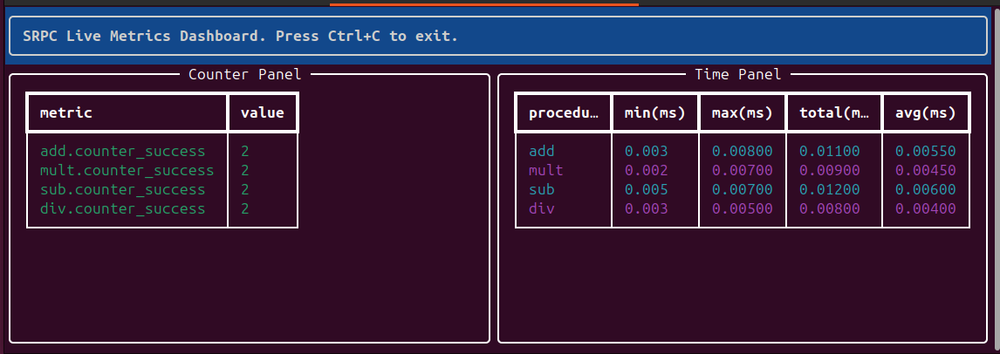

# SRPC Technical Documentation

## Table of contents
- [SRPC Technical Documentation](#srpc-technical-documentation)
  - [Table of contents](#table-of-contents)
  - [1. Introduction \& Concepts](#1-introduction--concepts)
    - [1.1 Wat is RPC](#11-wat-is-rpc)
    - [1.2 The SRPC](#12-the-srpc)
  - [2. High-Level Architecture](#2-high-level-architecture)
    - [2.1 What is a Service in SRPC](#21-what-is-a-service-in-srpc)
    - [2.2 Logical Architecture Diagram](#22-logical-architecture-diagram)
  - [3. The SRPC Protocol](#3-the-srpc-protocol)
    - [3.1 Wire Protocol](#31-wire-protocol)
      - [3.1.1 Server response types](#311-server-response-types)
      - [3.1.2 Protocol diagram](#312-protocol-diagram)
  - [4. Core Compoentes(The Internals)](#4-core-compoentesthe-internals)
    - [4.1 The Serializer](#41-the-serializer)
    - [4.2 Binder / Port Mapper](#42-binder--port-mapper)
      - [4.2.1 Server Binder](#421-server-binder)
      - [4.2.2 Client Binder](#422-client-binder)
    - [4.3 Stubs(The Proxies)](#43-stubsthe-proxies)
      - [4.3.1 Server Stub \& Threading Model](#431-server-stub--threading-model)
        - [4.3.1.1 Thread Model Diagram](#4311-thread-model-diagram)
        - [4.3.1.2 How it is generated](#4312-how-it-is-generated)
      - [4.3.2 Client Stub \& Threading Model](#432-client-stub--threading-model)
        - [4.3.2.2 How it is generated](#4322-how-it-is-generated)
  - [5. Tooling \& Ecosystem](#5-tooling--ecosystem)
    - [5.1 Stub Generator](#51-stub-generator)
    - [5.2 Metrics](#52-metrics)
      - [5.2.1 The Live Dashboard](#521-the-live-dashboard)
      - [5.2.2 Server-Side Logging](#522-server-side-logging)


## 1. Introduction & Concepts

### 1.1 Wat is RPC
"In distributed computing, a remote procedure call (RPC) is an action in which a computer program causes a procedure to execute in a different address space of the current process (commonly on another computer on a shared computer network), which is written as if it were a local procedure call, without the programmer explicitly writing the details for the remote interaction. That is, the programmer writes essentially the same code whether the subroutine is local to the executing program, or remote. This is a form of server interaction (caller is client, executor is server), typically implemented via a request–response message passing system.The RPC model implies a level of location transparency, namely that calling procedures are largely the same whether they are local or remote, but usually, they are not identical, so local calls can be distinguished from remote calls. Remote calls are usually orders of magnitude slower and less reliable than local calls, so distinguishing them is important." - [Remote procedure call](https://en.wikipedia.org/wiki/Remote_procedure_call).

**Every modern service mesh is descendent of this ideia - just with better Cryptography and fewer open doors.**

"How it works? First, the caller process sends a call message that includes the procedure parameters to the server process. Then, the caller process waits for a reply message (blocks). Next, a process on the server side, which is dormant until the arrival of the call message, extracts the procedure parameters, computes the results, and sends a reply message. The server waits for the next call message. Finally, a process on the caller receives the reply message, extracts the results of the procedure, and the caller resumes execution.

The Remote Procedure Call Flow figure (Figure 1) illustrates the RPC paradigm." - [RPC Model](https://www.ibm.com/docs/en/aix/7.3.0?topic=call-rpc-model).

Figure 1. Remote Procedure Call Flow



### 1.2 The SRPC
SRP uses the RPC ideia, and provide a framework to make easy programmers implement services(set of procedures).
SRPC uses Python as IDL(Interface Definition Language), specifically the [abc module](https://docs.python.org/3/library/abc.html) to define service boundaries.

For those with a knack for language design, the idea is to view the use of [abstract types](https://en.wikipedia.org/wiki/Abstract_type)
as "a language" for specifying protocols or interfaces. As many languages implements this concept, essentialy the challenge to extend
the LIB for others langues is to understand "Sockets", "abstract types" and how each language implement types.
Now the LIB only suport Python language.

In the current stage of the project the technical aim is build a solid, extensibile and esay to refactor fundation.
thinking from the users' perspective - programers - the aim is simplify the implementation of distributed processes while preserving a clean programming abstraction.

Core Design Goals:
- Rapid Prototyping: Minimal setup, and auto-generated network bindings.
- Transparent Abstraction: Remote exceptions should feel like local exceptions to the client.

## 2. High-Level Architecture

### 2.1 What is a Service in SRPC
In SRPC, a "Service" is defined strictly by its directory structure and Python naming conventions.  \
This strictness enables the tooling to automatically generate network bindings.

A valid service(in server side) consists of:
1. The Interface: An abstract class defining the methods.
   - The class name must follow the <ServiceName>Interface pattern with an uppercase first letter (e.g., CalcInterface).
   - The class file name must follow the <ServiceName>_interface with an lowercase first letter (eg., calc_interface.py)

2. The Implementation:
   - A concrete class inheriting from the interface, named <ServiceName> with an uppercase first letter (e.g., Calc).
   - the concrete class file name must follow the <ServiceName>.py with an lowercase first letter(eg., calc.py)

3. The Directory
   - The packge directory containing these files must match the package name(all lowercase) exactly (e.g., calc/).

Look the example below, <em>calc</em> is my service name.

**Server Directory Structure**
```
project/
├─ calc/
│  ├─ __init__.py
│  ├─ calc_interface.py
│  ├─ calc.py
├─ srpc_calc_server_stub.py
├─ server.py
.
.
.
```
**Essentialy a SRPC service is an interface**

### 2.2 Logical Architecture Diagram


## 3. The SRPC Protocol

### 3.1 Wire Protocol
Here I describe how SRPC uses the TCP protocol to exchange messages between the client and the server.
> [!IMPORTANT]
> Each procedure call on client side establishes a new connection to the server
>
> SRPC serializes Python strings and tuples into bytes before transmitting them over the network.

In the server side, there is a listner for each registered procedure. Each listner one waits for incomming client connections using ``` accept() ``` method  from [Python's socket module (the low-level networking interface)](https://docs.python.org/3/library/socket.html).

When a client connects, ```accepts()``` return a new socket dedicated to that connection. The server then calls ```recv(1024)``` on this socket to receive the client's request.

The server expects the request to be a tuple in the following format: ```(func_name, parameters)```

where:
-  ```func_name``` is the procedure of the procedure to invoke.
- ```parameters``` is a Python  tuple containing the procedure's arguments.

After deserializing the request, the server invokes the corresponding procedure.  \
If the call succeeds, it returns the following response tuple:  \
```("200", "", result)```

where:
- ```200``` indicates sucess.
- ```""``` represents the absence of an error message.
- ```result```  is the rutn value of the procedure.

If the call fails, it returns a tuple int the following format :  \
```(<error_code>, <error_message>, <exception_class>)```

The response is serialized and sent to the client using the ```sendall(...)``` method from Python's socket module.

The value ```1024``` passed to ```recv(1024)``` is a convenient buffer size.

> [!WARNING]
> recv(1024) does not means "Receive the whole message, up to 1024 bytes."
> it means "Receive at most 1024 bytes that are currently available."

#### 3.1.1 Server response types

**Error**

| error code | error message        | exception class |
|:----------------------------------|:-------------:|---------------:|
|"404"       | "The program cannot support the requested procedure"| "SrpcProcUnvailException"|
|"500"       | ```str(exception)``` | ```type(exception).__name__``` |

**Sucess**
| response code | message        | result |
|:-------------------------------|:-------------:|---------------:|
|"200"          | ""             | is the rutn value of the procedure|

#### 3.1.2 Protocol diagram


## 4. Core Compoentes(The Internals)
### 4.1 The Serializer
The SRPC serializer is a simple class called ```SrpcSerializer(srcp_serializer.py)```, that have two methods,  \
```serialize(self, data)``` and ```deserialize(self, data)``` . Currently they are simple [pickle(Python object serialization)](https://docs.python.org/3/library/pickle.html) wrapers.

```serialize(self, data)``` returns ```pickle.dumps(data)```

and ```deserialize(self, data)``` returns ```pickle.loads(data)```

When I was designing I thought it was a good aproach, so the lib can have an extensible class for serialization.  \
And I can change how do I serialize/deserialize only refatoring the fallowing files:
- ```srpc_serializer_interface.py```
- ```srcp_serializer.py```

> [!NOTE]
> Among other factors, the use of a Python-specific serialization mechanism limits the library's portability,
> as it prevents straightforward interoperability with implementations in other programming languages.

### 4.2 Binder / Port Mapper
"The port mapper program maps RPC program and version numbers to transport-specific port numbers.  \
This program makes dynamic binding of remote programs possible.

This is desirable because the range of reserved port numbers is very small and  \
 the number of potential remote programs is very large.  \
By running only the port mapper on a reserved port, the port numbers of other remote programs  \
can be ascertained by querying the port mapper." - [RFC 1057](https://datatracker.ietf.org/doc/html/rfc1057), APPENDIX A.

>[!NOTE]
>This functionality will be removed.
>Eventualy the project gonna follow the [contract-first](https://en.wikipedia.org/wiki/Design_by_contract) aproach.

#### 4.2.1 Server Binder
In SRPC the Server Binder is builtin with the service during server stub generation.  \
A Binder is an object that have ```start_binder``` and ```stop``` methods, this is defined in  \
```SrpcServerBinderInterface(srpc_server_binder_interface.py)``` interface. it is implemented in
```SrpcServerBinder(srpc_server_binder.py)``` class.

**Essentialy, in SRPC, the Server Binder holds and serves a Python dictionary where the key is the procedure name and value is the port number**

In the current version(V0.0.0), by standard, every service is listing in TCP port ```5000``` for two types of requests:
- ```("REGISTER", <func_name>, <port_number>)``
- ```("LOOKUP", None, None)```

The ```REGISTER``` is used to append the pair procedure name and port in the binder dictionary.
So after the call of  ```socket.bind(host, 0)``` It is used sockets, on the server it self, to make a ```REGISTER``` request.  \
look the code below:
```
scoket.bind((self.__host, 0))
port = socket.getsockname()[1]
self.__register_func_in_binder(func_name, port)
```
The ```register_func_in_binder(func_name, port)``` is called for each procedure of the service.

The ```LOOKUP``` is used in client side two get the dictionary of procedures and ports.

Check below how the class ```SrpcServerBinder(srpc_server_binder.py)``` handle this requests:
```python
def __handle_lookup_request(self, conn):
    try:
        msg = conn.recv(1024)
        request_tuple = self.__serializer.deserialize(msg)
        if request_tuple[0] == "LOOKUP":
            response_tuple = ("200", "", self.__functions)
            self.__total_lookup_request += 1
            self.__logger.info(
                f"Total lookup requests: {self.__total_lookup_request}"
            )
        elif request_tuple[0] == "REGISTER":
            req_function = request_tuple[1]
            port = request_tuple[2]
            self.__functions[req_function] = port
            response_tuple = ("200", "", None)
            self.__logger.info(
                f"Function [{req_function}] registered on port #[{port}]"
            )
        else:
            self.__logger.error(f"Unknown request type: {request_tuple[0]}")
            response_tuple = ("500", "erro simulado", None)
```

#### 4.2.2 Client Binder
In SRPC a Client Binder is an object with that have ```binding_lookup``` method.  \
His role is give the hability for client aplication to get the dictionary of procedures, with correpondent port, from the server.  \
So the client side will make this request ```("LOOKUP", None, None)``` to the server.  \
The response is the dictionary mentioned in *4.2.1 Server Binder*.

>[!NOTE]
>A "Client Binder" is conceptualy wrong.
>
>The client side make only one ```LOOKUP``` request in the client stub constructor.

### 4.3 Stubs(The Proxies)
"In distributed computing, a stub is a program that acts as a temporary replacement for a remote service or object.
It allows the client application to access a service as if it were local, while **hiding the details of**
**the underlying network  communication**. This can simplify the development process, as the client application
does not need to be aware of the complexities of distributed computing. Instead, it can rely on the stub to handle the remote
communication, while providing a familiar interface for the developer to work with." - [Stub (distributed computing)](https://en.wikipedia.org/wiki/Stub_(distributed_computing))

**Essentialy the stub role is to hide the details of network comunication in distributed applications(in server and client side)**

#### 4.3.1 Server Stub & Threading Model
In SRPC the Server Stub is a object with the fallow methods:
- ```start```
- ```stop```

The interface is defined in ```SrpcServerStubInterface(srpc_server_stub_interface.py)```.

The ```start``` reponsable to set the procedure-port dictionary, start one concurrent thread for each procedure
and start the binder in it own concurrent thread

The ```stop``` method will shotdown the Binder thread and all procedures threads.

##### 4.3.1.1 Thread Model Diagram


Each listner thread trigger ```n``` handler thread and, each handler thread execute a copy of it correpondent procedure.
Internaly the binder uses a Thread pool look the code below:
```python
with ThreadPoolExecutor(max_workers=5) as pool:
    while not self.__shutdown_event.is_set():
        try:
            client_socket, client_address = self.__binder_socket.accept()
            pool.submit(self.__handle_lookup_request, client_socket)
```
And inside the server stub is triggered as below:
```python
binder_thread = threading.Thread(target=self.__binder.start_binder, name="binder_thread", daemon=True)
```

Each procedure thread is trigrered as below:
```python
for func_name in self.__lib_procedures_name:
    t = threading.Thread(None,
        target=self.__listen_for_func,
        name=f"Thread-Listener-for-func-{func_name}",
        args=[func_name])

        self.__threads.append(t)
        t.start()
```
A thread pool for handlers threads is also used as below:
```python
...
self.__executor = ThreadPoolExecutor(max_workers=10)
...
 def __listen_for_func(self, func_name):
        with socket.socket(socket.AF_INET, socket.SOCK_STREAM) as s:
            s.setsockopt(socket.SOL_SOCKET, socket.SO_REUSEADDR, 1)
            s.bind((self.__host, 0))
            port = s.getsockname()[1]
            self.__register_func_in_binder(func_name, port)
            s.listen()
            s.settimeout(1.0)

            while not self.__stop_event.is_set():
                try:
                    conn, addr = s.accept()
                    self.__executor.submit(self.__handle_request, func_name, conn, addr)
                except socket.timeout:
                    continue
                except Exception as e:
                    self.__logger.error(f"An error occurred while listening for function [{func_name}] in port [{port}]: {e}")
                    os._exit(1)

```

> [!WARNING]
> This "chain" of threads trigrering threads could affect the LIB performance.
> We should review this.

##### 4.3.1.2 How it is generated
The server stub is generated by the script in ```srpc_server_stub_gen.py```.
In this script is used parametrizied strings for thinkgs like: ```DEFAULT_BINDER_PORT```, ```func_name```

**below how Server Stub code look like**
```python
class Srpc{module_name.capitalize()}ServerStub(SrpcServerStubInterface):
    def __init__(self):
        self.__mestrics = SrpcMetric("{log_path}")

        self.__host = get_lan_ip_or_localhost()
        self.__binder = SrpcServerBinder(self.__host)
        self.__BINDER_PORT = {DEFAULT_BINDER_PORT}
        ...


    def __set_metrics(self, func_name):
      ...

    def __get_lib_procedures_name(self):
        return [name for name, member in inspect.getmembers({interface_name}, predicate=inspect.isfunction)]

    def __check_implements_interface(self, obj, interface):
        if not isinstance(obj, interface):
            logging.error(f"Object of type {{type(obj).__name__}} must implement interface {{interface.__name__}}")
            self.__logger.error("Mission aborted.")
            os._exit(1)

    def __call_func(self, t: tuple):
        try:
            method = getattr(self.__lib_procedures, t[0])
            return method(*t[1:])
        except AttributeError:
            return None

    def __register_func_in_binder(self, func_name, port):
        #setting metric for the function
        self.__set_metrics(func_name)
        try:
            socket_cli = socket.socket(socket.AF_INET, socket.SOCK_STREAM)
            socket_cli.connect((self.__host, self.__BINDER_PORT))
            request = ("REGISTER", func_name, port)
            serialized_request = self.__serializer.serialize(request)
            socket_cli.sendall(serialized_request)

            serialized_response = socket_cli.recv(1024)
            deserialized_response = self.__serializer.deserialize(serialized_response)

            if deserialized_response[0] != "200":
                raise SrpcBinderRequestException(deserialized_response[1], code=deserialized_response[0])
        ...


    def __handle_request(self, func_name, conn, addr):
        with conn:
            try:
                msg = conn.recv(1024)
                request_tuple = self.__serializer.deserialize(msg)

                if isinstance(request_tuple, tuple) and request_tuple[0] == func_name:
                    self.__logger.info(f"Request: {{request_tuple}} from: {{addr[0]}}")
                    start_time = time.time()  # Start time measurement
                    result = self.__call_func(request_tuple)
                    end_time = time.time()  # End time measurement
                    response = ("200", "", result)
                    self.__mestrics.inc_counter_success(f"{{func_name}}")
                    self.__mestrics.record_time(f"{{func_name}}", end_time - start_time)
                else:
                    raise SrpcProcUnvailException("The program cannot support the requested procedure.")
        ...

    def __listen_for_func(self, func_name):
        with socket.socket(socket.AF_INET, socket.SOCK_STREAM) as s:
            s.setsockopt(socket.SOL_SOCKET, socket.SO_REUSEADDR, 1)
            s.bind((self.__host, 0))
            port = s.getsockname()[1]
            self.__register_func_in_binder(func_name, port)
            s.listen()
            s.settimeout(1.0)

            while not self.__stop_event.is_set():
                try:
                    conn, addr = s.accept()
                    self.__executor.submit(self.__handle_request, func_name, conn, addr)
                except socket.timeout:
                    continue
                except Exception as e:
                    self.__logger.error(f"An error occurred while listening for function [{{func_name}}] in port [{{port}}]: {{e}}")
                    os._exit(1)

    def start(self):
        stop_event = threading.Event()
        binder_thread = threading.Thread(target=self.__binder.start_binder, name="binder_thread", daemon=True)
        binder_thread.start()
        try:
            for func_name in self.__lib_procedures_name:
                t = threading.Thread(None,
                    target=self.__listen_for_func,
                    name=f"Thread-Listener-for-func-{{func_name}}",
                    args=[func_name]
                    )
                self.__threads.append(t)
                t.start()
            self.__logger.info(f"SRPC server started [tcp-{{self.__host}}-{DEFAULT_BINDER_PORT}]. press Ctrl+C to stop")
            stop_event.wait()
        ...

    def stop(self):
      ...
"""
```

#### 4.3.2 Client Stub & Threading Model
In SRPC the Client Stub have internaly two classes ```SrpcClientStub```
and ```Srpc<service-name>ClientStub```.

```Srpc<service-name>ClientStub``` is an internal class that handle network operations:
- binding_lookup
- remote_call
Client Stub uses an Client Binder object and, mantains the dictionary of precedures and port in memory.
Client Stub get this dictionary using ```binder.binding_loolup()``` method.
The ```remote_call``` method is implemented, inside ```_SrpcClientStub```, And it is used to efectively make a request to de server
for "calling" a specific method.

look below an example of generated code of ```_SrpcClientStub``` class

```python
class _SrpcClientStub(SrpcClientStubInterface):

    def __init__(self, server_host):
        self.__serializer = SrpcSerializer()
        self.__server_host = server_host
        self.__functions = {}
        self.__bind()

        self.__logger = logging.getLogger(__name__)
        self.__logger.setLevel(logging.INFO)
        self.__console_handler = logging.StreamHandler()
        self.__formatter = logging.Formatter("%(asctime)s [%(levelname)s] %(name)s: %(message)s")
        self.__console_handler.setFormatter(self.__formatter)
        self.__logger.addHandler(self.__console_handler)

    def __bind(self):
        binder = SrpcClientBinder(self.__server_host)
        self.__functions = binder.binding_lookup()

    def remote_call(self, func_name, parameters: tuple):
        try:
            socket_cli = socket.socket(socket.AF_INET, socket.SOCK_STREAM)
            socket_cli.connect((self.__server_host, self.__functions[func_name]))

            request = (func_name, *parameters)
            serialized_request = self.__serializer.serialize(request)
            socket_cli.sendall(serialized_request)

            serialized_response = socket_cli.recv(1024)
            deserialized_response = self.__serializer.deserialize(serialized_response)

            #(code, message, excepiton type)
            if deserialized_response[0] == "500":
                raise SrpcCallException(deserialized_response[1], deserialized_response[2])
            elif deserialized_response[0] == "404":
                raise SrpcProcUnvailException(deserialized_response[1])

            return deserialized_response[2]

        except SrpcCallException as e:
            raise SrpcCallException(e.message, e.code)
        except SrpcProcUnvailException as e:
            self.__logger.error(f"Procedure {func_name} unavailable: {e.message}")
        except socket.timeout:
            self.__logger.error("Timeout occurred during RPC call.")
        except socket.gaierror:
            self.__logger.error(f"Network error: Unable to connect to the server.")
        except ConnectionRefusedError:
            self.__logger.error(f"Connection refused. Is the server running and reachable?")
        except socket.error as e:
            self.__logger.error(f"Socket error: {e}")
        except OSError as e:
            self.__logger.error(f"OS error during RPC call: {e}")
```

```Srpc<service-name>ClientStub``` is a public class that implements the service interface and, uses ```SrpcClientStub```
to make the remote calls. look below an example look below an example of generated code of ```Srpc<service-name>ClientStub``` class:

```python
class SrpcCalcClientStub(CalcInterface):
    def __init__(self, server_host='127.0.0.1'):
        self.__client_stub = _SrpcClientStub(server_host)

    def add(self, a, b):
        try:
            return self.__client_stub.remote_call('add', (a, b) )
        except SrpcCallException as e:
            exc_name = e.code #exception type
            exc_class = eval(exc_name)
            raise exc_class(e.message)
...
```

Both class will be in a generated file caled ```srpc_<service-name>_client_stub.py```

The Client Stub uses a simple thread model.
##### 4.3.2.2 How it is generated
The Client Stub is generated by the script in ```srpc_client_stub_gen.py```.
In this script is used parametrizied strings for thinkgs like: ```lib_name```, ```module_name```

## 5. Tooling & Ecosystem
### 5.1 Stub Generator
The tool to generate the stubs is srpc_stub_gen. With the lib instaled, run the command below, inside the server directory:

``` python -m srpcLib.tools.srpc_stub_gen <service-name>/<service-name>_interface.py ```

This will generate two files srpc_<service-name>_server_stub.py and srpc_<service-name>_client_stub.py.

```srpc_<service-name>_server_stub.py``` is the server-side stub

```srpc_<service-name>_client_stub.py``` is the client-side stub

Move the ```srpc_<service-name>_client_stub.py``` file to client directory.

### 5.2 Metrics
In the current version(V0.0.0) SRPC have it won simple metric module called ```SrpcMetric(srpc_metric.py)```.
It is especified in the interface ```SrpcMetricsInterface(srpc_metrics_interface.py)``` look int the implementaion below in the file ```SrpcMetric(srpc_metric.py)```:

```python
class SrpcMetric(SrpcMetricsInterface):
    def __init__(self, log_path: str):
        self.__mestrics = []

        self.__logger = logging.getLogger(__name__)
        self.__logger.setLevel(logging.INFO)
        self.__file_handler = logging.FileHandler(log_path)
        self.__formatter = logging.Formatter(
            "%(asctime)s [%(levelname)s] %(name)s: %(message)s"
        )
        self.__file_handler.setFormatter(self.__formatter)
        self.__logger.addHandler(self.__file_handler)

    def add_metric(self, metric_name, metric_type):
        self.__mestrics.append((f"{metric_name}.{metric_type}"))

    def inc_counter_success(self, metric_name):
        if f"{metric_name}.{SrpcmetricsTypes.COUNTER_SUCCESS}" in self.__mestrics:
            self.__logger.info(f"{metric_name}.{SrpcmetricsTypes.COUNTER_SUCCESS}=1")

    def inc_counter_fail(self, metric_name):
        if f"{metric_name}.{SrpcmetricsTypes.COUNTER_FAIL}" in self.__mestrics:
            self.__logger.info(f"{metric_name}.{SrpcmetricsTypes.COUNTER_FAIL}=1")

    def record_time(self, metric_name, time_taken):
        if f"{metric_name}.time" in self.__mestrics:
            self.__logger.info(
                f"{metric_name}.{SrpcmetricsTypes.TIME}={round(time_taken * 1000, 3)}"
            )
```

The ideia is simple, mantain a list with metrics, and make updates on them not in memory but log it in a file.

When ``` add_metric ``` is called it add in the list metric, a String, in the format ```<metric_name>.<metric_time>```.  \
When ``` inc_counter_sucess ``` is called it just log the String ``` "<metric_name>.counter_success=1" ``` in a file ```srpc_server_metrics.log```.  \
When ``` inc_counter_fail ``` is called it just log the String  ``` "<metric_name>.counter_fail=1" ``` in the file ```srpc_server_metrics.log```.  \
When ``` record_time ```is called it just log the String ```"<metric_name>.time=<time-in-seconds-between-before-and-after-call-the-correpondent-procedure>"```.  \

look below an example of use of metricsc(``` add_metric```,``` inc_counter_sucess```, ``` inc_counter_fail ```):

```python
def __init__(self):
    self.__mestrics = SrpcMetric("./srpc_server_metrics.log")
...

def __set_metrics(self, func_name):
    self.__mestrics.add_metric(func_name, SrpcmetricsTypes.COUNTER_SUCCESS)
    self.__mestrics.add_metric(func_name, SrpcmetricsTypes.COUNTER_FAIL)
    self.__mestrics.add_metric(func_name, SrpcmetricsTypes.TIME)
...
def __handle_request(self, func_name, conn, addr):
    with conn:
        try:
            msg = conn.recv(1024)
            request_tuple = self.__serializer.deserialize(msg)

            if isinstance(request_tuple, tuple) and request_tuple[0] == func_name:
                self.__logger.info(f"Request: {request_tuple} from: {addr[0]}")
                start_time = time.time()  # Start time measurement
                result = self.__call_func(request_tuple)
                end_time = time.time()  # End time measurement
                response = ("200", "", result)
                self.__mestrics.inc_counter_success(f"{func_name}")
                self.__mestrics.record_time(f"{func_name}", end_time - start_time)
            else:
                raise SrpcProcUnvailException("The program cannot support the requested procedure.")
        except SrpcProcUnvailException as e:
                self.__logger.info(f"Procedure [{func_name}] is unavailable: {e.message}")
                response = ("404", e.message, type(e).__name__)
        except Exception as e:
                self.__logger.error(f"Function [{func_name}] call error: {e}")
                response = ("500", str(e), type(e).__name__)
                self.__mestrics.inc_counter_fail(f"{func_name}")
        finally:
                conn.sendall( self.__serializer.serialize(response))
...
```
> [!NOTE]
> The start_time and end_time may be should count also the time to send the response not only the procedure time execution.

>[!WARNING]
> This feature have a Disk usage trap.  \
> In the current version(V0.0.0) does not have an automatic "cleaner" for the file ```srpc_server_metrics.log```  \
> So the file size will grow indefinitely consequtently the use of the Disk.

#### 5.2.1 The Live Dashboard
The installation of the LIB came with the ```srpc_show_metrics``` utilitary. You can use it in the server it gonna read the file ```srpc_server_metrics.log```  \
To show the below metrics:
- Count metrics
  - success counter
  - faulure counter
- time metric
  - min(ms)
  - max(ms)
  - total(ms)
  - avg(ms)

The Ideia behind this tool is to "watch" the file ```srpc_server_metrics.log``` like the ```tail``` command in linux.
When this tools is called it go to the end of the file and start watch for new lines every ```100ms```. look teh function below:
```python
def follow(thefile):
    thefile.seek(0, os.SEEK_END)

    while True:
        line = thefile.readline()
        if not line:
            time.sleep(0.1)
            continue

        yield line

```
To undertand the use of ```yield``` and fully understand this function you need know about [Generators](https://en-wikipedia-org.translate.goog/wiki/Generator_(computer_programming)?_x_tr_sl=en&_x_tr_tl=pt&_x_tr_hl=pt&_x_tr_pto=tc).

I also have a pratical reference about iterators and generators [here](https://github.com/oseasandrepro/LPX).

Look below hos this function is used:
```python
...
        # Live refresh
        with Live(layout, refresh_per_second=4, screen=True):
            logfile = open(log_path, "r")
            loglines = follow(logfile) # <------------------------------------
            for line in loglines:
                metric = line.split(" ")[4]
                metric_name = metric.split("=")[0]
                if (metric_name.split(".")[1] == SrpcmetricsTypes.COUNTER_FAIL) or (
                    metric_name.split(".")[1] == SrpcmetricsTypes.COUNTER_SUCCESS
                ):
                    increment_counter(metric_name)
                    panel = Panel(generate_couter_table(), title="Counter Panel")
                    layout["left"].update(panel)
                else:
                    value = float(metric.split("=")[1])
                    update_timer_metric(metric_name, value)
                    panel = Panel(generate_timer_table(), title="Time Panel")
                    layout["right"].update(panel)
...
```

The script of this tools is in ```srpc_show_metrics.py```

**How to use it?**

Inside the server directory run this command ```python -m srpcLib.tools.srpc_show_metrics srpc_server_metrics.log```

You will see in something like the image below:



>[!WARNING]
> This tool have a memory trap.  \
> It is used a List to mantain in memory each loged line, to compute the metrics.  \
> So the use of memory will grow indefinitely. Therefore it is not recommend to use this tools a long period of time.

> [!CAUTION]
> From the point of view of OS/"low leve" architecture we could have concurrency to read/werite in the file ```srpc_server_metrics.log```.  \
> Here We are talkin about real concurrence since the server service(the writer) and the the srpc_show_metrics tool will run in
> different process. So eventualy they can run in parallel - In a Multicore machine
#### 5.2.2 Server-Side Logging
While runing the server log in the console informations about request being handled.
